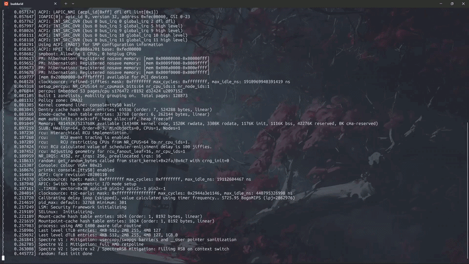

# CVE-2020-27786

## demo



### starting up
looking up the advisory in [github](https://github.com/advisories/GHSA-3MFQ-6299-P3W3) , we can see the bug is in the `MIDI` driver which is a sound driver . It also says that it the bug results in UAF write primitive .

### analysis
looking up the [patch commit](https://git.kernel.org/pub/scm/linux/kernel/git/torvalds/linux.git/commit/?id=c1f6e3c818dd734c30f6a7eeebf232ba2cf3181d) specified in the advisory  , we get more insight on the bug . Essencially , what the author says is , a race condition exists when reading/writing against other IOCTL functionnalities , for example the resize IOCTL option , which can result in these read/write operating on already freed (and maybe reallocated) memory  

### code analysis 
first let's get a little bit familiar with the code 

- device registration : 
```C
static int snd_rawmidi_dev_register(struct snd_device *device)
{
	...
	err = snd_register_device(SNDRV_DEVICE_TYPE_RAWMIDI,
				  rmidi->card, rmidi->device,
				  &snd_rawmidi_f_ops, rmidi, &rmidi->dev);
	if (err < 0) {
		rmidi_err(rmidi, "unable to register\n");
		goto error;
	}
	if (rmidi->ops && rmidi->ops->dev_register) {
		err = rmidi->ops->dev_register(rmidi);
		if (err < 0)
			goto error_unregister;
	}
    ...
	sprintf(name, "midi%d", rmidi->device);
	entry = snd_info_create_card_entry(rmidi->card, name, rmidi->card->proc_root);
	if (entry) {
		entry->private_data = rmidi;
		entry->c.text.read = snd_rawmidi_proc_info_read;
		if (snd_info_register(entry) < 0) {
			snd_info_free_entry(entry);
			entry = NULL;
		}
	}
	rmidi->proc_entry = entry;
	return 0;

}
```
we can see it registers a char device (available in `/dev`) with some `snd_rawmidi_f_ops` struct 
```C
static const struct file_operations snd_rawmidi_f_ops = {
	.owner =	THIS_MODULE,
	.read =		snd_rawmidi_read,
	.write =	snd_rawmidi_write,
	.open =		snd_rawmidi_open,
	.release =	snd_rawmidi_release,
	.llseek =	no_llseek,
	.poll =		snd_rawmidi_poll,
	.unlocked_ioctl =	snd_rawmidi_ioctl,
	.compat_ioctl =	snd_rawmidi_ioctl_compat,
};
```
your typical menu , we'll use open , write and ioctl for the exploit 
- write function : it all comes down to this function `snd_rawmidi_kernel_write1` 
```C
{
	...
	spin_lock_irqsave(&runtime->lock, flags);
	
	while (count > 0 && runtime->avail > 0) {
		...
		else if (userbuf) {
			spin_unlock_irqrestore(&runtime->lock, flags);
			if (copy_from_user(runtime->buffer + appl_ptr,
					   userbuf + result, count1)) {
				...
			}
			spin_lock_irqsave(&runtime->lock, flags);
		}
		result += count1;
		count -= count1;
	}
    ...
}
```
as you can see (and this part of the code is also addressed in the patch) , the function takes a spinlock , then releases the spinlock just before the `copy_from_user` which effectivily copies data from userland to the kernel buffer . But why even release the lock ? are the devs really that stupid ? the question really bugged me , especially seeing that the patch didnt just place the `spin_unlock_irqrestore` after the `copy_from_user` , but introduced a different reference counting methodology which is way more complicated . So i had to go for a sidequest (which i will document down below) . 

- read function : same as write , with even the same bug , but for some reason , i couldn't trigger it from userland easily like `write` so i ended up not using it in the exploit (took me a lot of time to move on xd)

- IOCTL : one of the ioctl commands is `SNDRV_RAWMIDI_IOCTL_PARAMS` which allows us to resize the buffer we write into 
```C
static int resize_runtime_buffer(struct snd_rawmidi_runtime *runtime,
				 struct snd_rawmidi_params *params,
				 bool is_input)
{
	char *newbuf, *oldbuf;

	if (params->buffer_size < 32 || params->buffer_size > 1024L * 1024L)
		return -EINVAL;
	if (params->avail_min < 1 || params->avail_min > params->buffer_size)
		return -EINVAL;
	if (params->buffer_size != runtime->buffer_size) {
		newbuf = kvzalloc(params->buffer_size, GFP_KERNEL);
		if (!newbuf)
			return -ENOMEM;
		spin_lock_irq(&runtime->lock);
		oldbuf = runtime->buffer;
		runtime->buffer = newbuf;
		runtime->buffer_size = params->buffer_size;
		__reset_runtime_ptrs(runtime, is_input);
		spin_unlock_irq(&runtime->lock);
		kvfree(oldbuf);
	}
	runtime->avail_min = params->avail_min;
	return 0;
}
```  
1. allocates a new buffer (from normal kmalloc slubs) with user controlled size 
2. replaces the old buffer with the new buffer
3. frees the old buffer
4. notice that the function also takes the lock then releases it , but that doesnt even matter 

### sidequest
trying to understand the spinlock mechanism , i stumbled upon the chapter of some [book](https://static.lwn.net/images/pdf/LDD3/ch05.pdf) , it explains concurrency very well btw . 
reading through it , i stumbled upon this 
```
Imagine for a moment that your driver acquires a spinlockand goes about its business within its critical section. Somewhere in the middle, your driver loses the processor. Perhaps it has called a function (copy_from_user, say) that puts the process to
sleep. Or, perhaps, kernel preemption kicks in, and a higher-priority process pushes
your code aside. Your code is now holding a lockthat it will not release any time in
the foreseeable future. If some other thread tries to obtain the same lock, it will, in
the best case, wait (spinning in the processor) for a very long time. In the worst case,
the system could deadlock entirely.
Most readers would agree that this scenario is best avoided. Therefore, the core rule
that applies to spinlocks is that any code must, while holding a spinlock, be atomic.
It cannot sleep; in fact, it cannot relinquish the processor for any reason except to
service interrupts (and sometimes not even then).
```
that's it for the sidequest . 

### putting it all together 
- we can resize our to-write buffer in the kernel 
- the lock is released write before `copy_from_user` , so in the scenario of an interrupt or context switch in the middle of it , some race condition with another thread might happen (a thread which can free our current buffer for example , which creates a write UAF situation )

### extending the race condition  
one known technique for extending such tight racing windows , is using the `userfaultd` syscall , which creates a kind of hooking system from the kernel to userland . For example , we can make it such that right when a kernel thread accesses some userland memory , the kernel immediately transfers control to some userland function .
In our case, we use it in the following way : 
1. place this 'hook' on some userland memory address , lets call it X . 
2. perform `write(fd,X,0x67)`
3. when the `copy_from_user` tries accessing  our userland address X , it triggers this hook and returns execution to userland 
4. we prepare this hook (in step 1) to perform the `IOCTL resize` , so it frees our current buffer that the `copy_from_user` is operating on 
5. return execution to kernel thread
6. `copy_from_user` copies data into freed memory

### primitives
- we have arbitrary write UAF on `kmalloc` slabs  , some useful structs that are allocated on general use slabs are `tty deckstruct` , `seq_operations`, `shm_file_data` , `msg_msg` ... We'll use `tty deckstruct` for function pointer overwrite later
- we need some leaks to bypass KASLR , it would've been easy if the `read` function worked ... Now we need to some other way for leaks . 

2 ways came to my mind : 
1. use this UAF on a pipe_buffer to partially overwrite its `page *` pointer and read the data of an arbitray page . Note that in later versions , pipe_buffers are allocated from `kmalloc-cg slabs` , but not in kernel 5.6 . This technique is very unreliable as the `buddy allocator` is very upredictable
2. overwrite the `size` member of msg_msg struct , with this if we change the size (it should be less than 0xfd0) , we can get OOB read , i used this method 

### exploit 
1. UAF on `msgmsg.size` to OOB read  already sprayed `tty deckstruct` objects , slab used for this is kmalloc-1k
2. use another fd , UAF directly on `tty deckstruct` to corrupt `const struct tty_operations *ops` , this struct will be corrupted as we will place our ropchain here on the object (Note that SMEP and SMAP and enabled)  
3. use IOCTL fct ptr as it is the less noisy one (we can read , write or close too) 
4. place a `leave ; ret` gadget on the function pointer as rbp points to our corrupted object when calling the fct pointer
5. pivot to our rop chain 
6. profit

into the next one.
