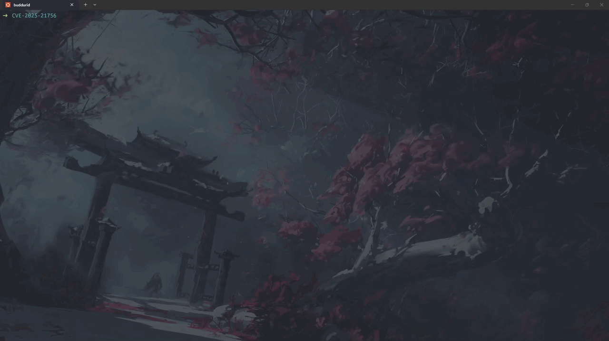

# CVE-2025-21756

## demo



### credits 
i wanna thank hoefler on his amazing [article](https://hoefler.dev/articles/vsock.html) on exploiting this CVE , we will be using 2 techniques he used in his exploit .

### starting up
looking up the [advisory](https://nvd.nist.gov/vuln/detail/CVE-2025-21756) , we can see the bug is in the `VSOCK` implementation . It also mentions a UAF . 

### ressources
this was my first time exploiting a socket bug , let alone a VSOCK one . So i needed to familiarize myself a bit with the VSOCK concepts so i can maybe understand the socket API's later . Here is a banger [article](https://medium.com/@F.DL/understanding-vsock-684016cf0eb0) i stumbled upon . 

### analysis
looking up the [patch commit](https://git.kernel.org/pub/scm/linux/kernel/git/stable/linux.git/commit/?id=3f43540166128951cc1be7ab1ce6b7f05c670d8b) , i personally didnt find the patch very useful at first , unlike the explication and code flow provided in the commit description . 

### code analysis 

i will update this with a diagram later .

### primitve 
achieving this UAF , here is how we can interact with our dangling pointer . 
1. through normal VSOCK operations , like `close , connect , bind , recv ...` , all of these functions trigger a `null pointer dereferance ` due to SElinux , before we even interact with our freed `sk` object (except close , we will use that later)
2. through `vsock_bind_table` , remember our sock is still registered at `vsock_bind_table` , to be exact , the `vsock_unbound_sockets` one . CTRL-SHIFT-F the term `vsock_bind_table` we can see it being used only in `vsock_diag_dump` . 

We will go for the second approach

We Will also need to cross cache this slab 

```bash
b* at sk_free
p $rdi
$1 = 0xffff888004419e00
gef> slab-contains 0xffff888004419e00
[+] Wait for memory scan
slab: 0xffffea0000110640
kmem_cache: 0xffffea0000110601
[*] Detected invalid value, continue exploring...
slab: 0xffffea0000110600
kmem_cache: 0xffff88800409cc00
base: 0xffff888004418000
name: RAWv6  size: 0x500  num_pages: 0x4
```
for the spraying , i did it a bit differently (maybe also simpler :3 ) than hoefler , here is my approach : 
1. spray half ((cpu_partial + 1) * objs_per_slab ) objects
2. create our victim object
3. spray the other half , to ensure our victim object is inside a slab where we fully control its objects
4. free the 12 objects allocated before and after our victim socket , that way we ensure the slab containing our victim object, has only our victim object allocated 
5. free one object from each slab (we are supposed to do it `cpu_partial` times , but when testing and debugging , only `cpu_partial - 3` times where needed)
6. uaf our object . triggering a free tries to put the slab to `partial list` , but partial_list is full (length==cpu_partial) , it returns the slab to the page allocator , which is the case  

With this , we exactly free one page of order 2 , which can be reclaimed easily later with msg-msg of size 1024-2048 , or spraying a bunch of pipes (not very deterministic because pipe pages are of order 0) . The reclaiming using msg_msg was very straight forward and easy , yet for some reason i kept getting a lot of unexpected behavior when trying the next step which is getting leaks . So i stuck to pipes .


### leaks 
Now comes hoefler brilliant idea to get leaks using a side-channel , i'm gonna let him explain it on my behalf in his [article](https://hoefler.dev/articles/vsock.html) , you can can scroll to `Diag Dump Sidechannel For Fun & Profit`

Now i used the same idea , but for the KASLR leak , i didnt brute force the entire first 32 bits, all i did was brute force KASLR entropy which is 3 nibbles (0xfff max iterations at most) knowing that `init_net` offset is fixed with `fg-kaslr` disabled .

### RIP
after getting the leak , all that is left is get RIP control , again i used his idea so i'm gonna let him explain (again xd) 
 
### putting it all together 
really learnt a lot from this nday , especially about socket internals , maybe it would have been a better idea to start with an older socket CVE . 

If you made it this far , and have a cool CVE i can try to POC  , please shoot me up at my discord . 

Hope you enjoyed the read . 
